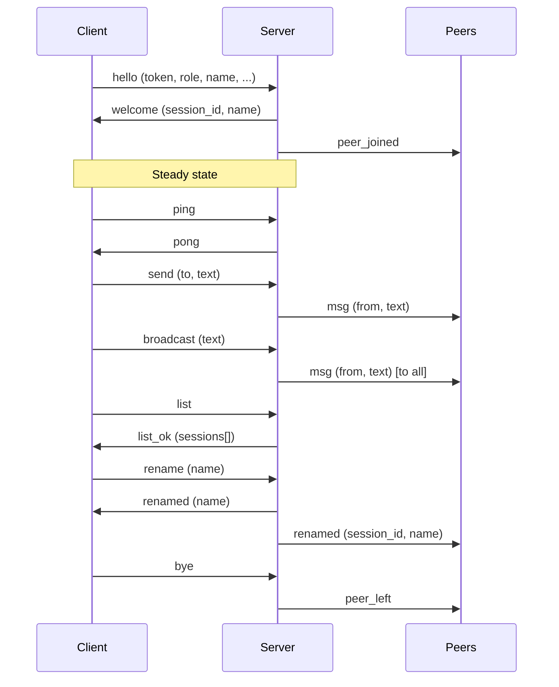
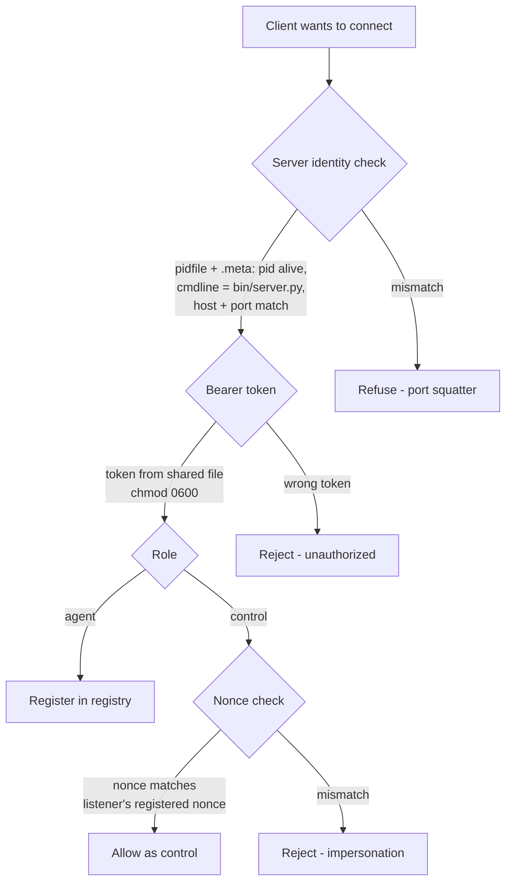

# Architecture

An agent-to-agent messaging bus. Multiple AI coding sessions on the
same Unix machine connect to a shared localhost WebSocket server and
exchange text messages in real time.

Currently built for Claude Code. The protocol and server are
framework-agnostic; the client layer is Claude Code-specific.

Single user, single machine. Unix-only (macOS / Linux / WSL2).

---

## Core concept

```
 Session A                                    Session B
 (any AI coding agent)                        (any AI coding agent)
      │                                            │
      │         ┌────────────────────┐             │
      │         │                    │             │
      ├────────►│    Message Bus     │◄────────────┤
      │         │    (server.py)     │             │
      │◄────────│                    │────────────►│
      │         └────────────────────┘             │
      │                                            │
  "run the tests"  ──────────►  "done: all pass"
```

The server is a message bus — a central relay that receives messages
and forwards them. Two routing modes:

- **Direct** — addressed to one agent by name. Server delivers to that
  agent only.
- **Broadcast** — server copies to all connected agents except the
  sender.

No topics, no subscriptions, no persistence. If you're connected, you
get your direct messages and all broadcasts. If you're not connected,
you miss them.

---

## Networking fundamentals

### Transport layer

```
 ┌─────────────────────────────────────────────────┐
 │  APPLICATION    JSON messages (the protocol)     │
 ├─────────────────────────────────────────────────┤
 │  WEBSOCKET      framing, message boundaries      │
 ├─────────────────────────────────────────────────┤
 │  TCP            reliable, ordered byte stream    │
 ├─────────────────────────────────────────────────┤
 │  IP             addressing, routing              │
 ├─────────────────────────────────────────────────┤
 │  LINK           physical wire / WiFi             │
 └─────────────────────────────────────────────────┘
```

### Why WebSocket

WebSocket provides persistent, bidirectional communication with
built-in message framing. The connection starts as an HTTP request
that upgrades:

```
 Client                                  Server
    │                                       │
    ├── GET / HTTP/1.1 ────────────────────►│
    │   Upgrade: websocket                  │
    │                                       │
    │◄──────────── HTTP 101 Switching ──────│
    │                                       │
    ╞═══════════════════════════════════════╡
    │    Now a persistent WebSocket.         │
    │    Both sides send JSON frames         │
    │    whenever they want.                 │
    ╞═══════════════════════════════════════╡
```

After the upgrade, each message is a lightweight frame (2-6 bytes of
overhead) containing a JSON payload. No HTTP headers repeated per
message.

**Why not alternatives:**

| Transport     | Framing? | Bidirectional? | Cross-platform? | Trade-off                    |
|:--------------|:---------|:---------------|:----------------|:-----------------------------|
| Raw TCP       | No       | Yes            | Yes             | Must build own framing       |
| WebSocket     | Yes      | Yes            | Yes             | Small HTTP upgrade cost      |
| Unix socket   | No       | Yes            | Unix only       | Fastest local, no framing    |
| HTTP          | Yes      | No (req/resp)  | Yes             | ~200-500 bytes overhead/msg  |
| stdio         | No       | Yes            | Yes             | Needs newline convention     |

WebSocket hits the sweet spot: framing built in, bidirectional, works
everywhere, minimal overhead.

---

## Process model

Three process classes:

```
┌──────────────────────────────────────────────────────────────┐
│                 AI Coding Session                             │
│                                                              │
│  ┌─────────────┐    stdout    ┌────────────────────────┐    │
│  │  Host app    │◄───────────│  client.py (monitor)    │    │
│  │  (LLM)       │            │  role=agent             │    │
│  └──────┬──────┘             │  long-lived             │    │
│         │                     └──────────┬─────────────┘    │
│         │ tool calls                     │ WebSocket         │
│  ┌──────▼──────┐                         │ (persistent)      │
│  │  send.py     │─── role=control ──┐    │                   │
│  │  list.py     │    (ephemeral)    │    │                   │
│  └─────────────┘                    │    │                   │
└─────────────────────────────────────│────│───────────────────┘
                                      │    │
                               ┌──────▼────▼──────┐
                               │   server.py       │
                               │   (message bus)    │
                               │   single instance  │
                               └──────────────────┘
```

### server.py — Message bus

Single asyncio WebSocket server per port. Responsibilities:

- **Registry** — maps `session_id` → connection state (name, label,
  cwd, pid, nonce, websocket handle, join time).
- **Routing** — direct (to one agent) and broadcast (to all agents).
- **Message log** — JSONL at `messages.log`, size-rotated, chmod 0600.
- **Idle shutdown** — exits after N minutes with zero agents (default
  10 min).
- **Auth** — bearer token verified on every connection.

### client.py — Per-session monitor

Long-lived WebSocket client, one per session. Each stdout line becomes
a host-app notification.

- **Dedup** — exclusive flock prevents duplicate monitors per session.
- **State file** — writes identity atomically so helpers can discover
  their owning session.
- **Reconnect** — exponential backoff 0.25 s → 4 s with ±20% jitter.
- **Name collision** — auto-retries with server-suggested names (up
  to 3 attempts).
- **Verbose mode** — `--verbose` enables additional stdout output
  including `peer_joined`, `peer_left`, and `renamed` events. Off by
  default; only `msg` events are printed in normal mode.

### send.py / list.py — Ephemeral helpers

Short-lived CLIs invoked by the host LLM. Connect as `role=control`,
do one thing, disconnect. Never appear in agent lists.

### Supporting modules

- **spawn.py** — server election + process spawn.
- **discover.py** — process-tree walk to find owning session.
- **shared.py** — paths, validation, constants, token management.
- **auto_start.py** — toggle monitor launch mode.

---

## Lifecycle

### Phase 1: Server election

Race-free via `bind()` atomicity. No external coordination.

```
 First client              Second client            Port 9473
      │                         │                       │
      ├── bind(:9473) ── wins ─────────────────────►   │
      │                         │                       │
      │                         ├── bind(:9473)         │
      │                         │   EADDRINUSE          │
      │                         │   (just connect)      │
      │                         │                       │
      ├── Popen(server.py       │                       │
      │     --fd=N,             │                       │
      │     pass_fds=(N,),      │                       │
      │     start_new_session   │                       │
      │     =True)              │                       │
      │        │                │                       │
      │        ▼                │                       │
      │   server.py adopts fd   │                       │
      │   writes pidfile+meta   │                       │
      │   calls listen()        │                       │
      │                         │                       │
      ├── connects as client    │                       │
      │                         ├── connects as client  │
```

Key details:
- `SO_REUSEADDR=1` — fast rebind after server crash.
- `os.set_inheritable(fd, True)` — required because Python (PEP 446)
  auto-sets `FD_CLOEXEC`, which silently closes the socket when the
  child process starts.
- Pidfile + `.meta` written before `listen()` — prevents a window
  where TCP probes succeed but identity files don't exist yet.
- `start_new_session=True` — server runs as a detached daemon,
  survives parent exit.

### Phase 2: Client connection

```
 client.py                              server.py
      │                                      │
      ├── acquire flock (<ppid>.lock)         │
      │   FAIL → "already running", exit     │
      │   OK   → sole monitor for session    │
      │                                      │
      ├── verify server identity              │
      │   read .meta → check pid alive,      │
      │   cmdline matches bin/server.py       │
      │   FAIL → refuse (port squatter)      │
      │                                      │
      ├── ws connect ──────────────────────►│
      │   (HTTP upgrade to WebSocket)        │
      │                                      │
      ├── hello ───────────────────────────►│
      │   { op: "hello",                    │
      │     token: "<bearer>",              │ ◄─ from shared file
      │     role: "agent",                  │
      │     session_id: "<uuid>",           │
      │     name: "<name>",                 │
      │     label: "<label>",               │
      │     cwd: "/path",                   │
      │     pid: 12345,                     │
      │     nonce: "<random>" }             │
      │                                      │
      │   server validates:                  │
      │   ├── token matches?                 │
      │   ├── name valid + available?        │
      │   └── register in _registry          │
      │                                      │
      │◄────────────────────────── welcome ──│
      │   { session_id, assigned_name }      │
      │                                      │
      │   server broadcasts to others:       │
      │   { op: "peer_joined", name: "..." } │
      │                                      │
      ├── write <ppid>.session atomically    │
      │   (so helpers can discover us)       │
      │                                      │
      └── enter receive loop                 │
```

### Phase 3: Name collision

```
 client                                  server
      │                                      │
      ├── hello { name: "my-project" } ────►│
      │                                      │
      │◄──── error: NAME_TAKEN ──────────────│
      │      candidates: ["my-project-2"]    │
      │                                      │
      ├── (auto-retry, attempt 1/3)          │
      ├── hello { name: "my-project-2" } ──►│
      │                                      │
      │◄──── welcome ───────────────────────│
```

### Phase 4: Sending a message

```
 LLM decides to send         send.py              server           recipient
      │                          │                    │                  │
      ├── Bash("send.py          │                    │                  │
      │   --to agent-b           │                    │                  │
      │   'run tests'")          │                    │                  │
      │                          │                    │                  │
      │            discover.py:  │                    │                  │
      │            walk process  │                    │                  │
      │            tree, find    │                    │                  │
      │            <ppid>.session│                    │                  │
      │                          │                    │                  │
      │                          ├── ws connect ────►│                  │
      │                          │                    │                  │
      │                          ├── hello ──────────►│                  │
      │                          │   role: "control"  │                  │
      │                          │   for_session: X   │                  │
      │                          │   nonce: Y         │ ◄─ must match   │
      │                          │                    │    listener's    │
      │                          │                    │    nonce         │
      │                          │                    │                  │
      │                          ├── send ───────────►│                  │
      │                          │   { to: "agent-b", │                  │
      │                          │     text: "..." }  │                  │
      │                          │                    │                  │
      │                          │          resolve target:              │
      │                          │          1. exact session_id          │
      │                          │          2. exact name                │
      │                          │          3. name prefix               │
      │                          │          4. session_id prefix (≥4ch)  │
      │                          │                    │                  │
      │                          │                    ├── msg ──────────►│
      │                          │                    │                  │
      │                          │                    │           stdout:│
      │                          │                    │  [inter-session  │
      │                          │                    │   msg=<id>       │
      │                          │                    │   from="agent-a"]│
      │                          │                    │   run tests      │
      │                          │                    │                  │
      │                          ├── disconnect       │                  │
```

### Phase 5: Reconnection

```
 client.py
      │
      ├── connection lost (server crash, network blip)
      │
      ▼
 ┌─────────────────────────────────────────┐
 │  Reconnect loop                          │
 │                                          │
 │  attempt 1: wait 0.25s (±20% jitter)    │
 │  attempt 2: wait 0.50s                   │
 │  attempt 3: wait 1.0s                    │
 │  attempt 4: wait 2.0s                    │
 │  attempt 5: wait 4.0s ◄── cap            │
 │  attempt 6: wait 4.0s                    │
 │  ...                                     │
 │                                          │
 │  On each attempt:                        │
 │  ├── ensure_server_running()             │
 │  │   (may re-elect + spawn a new server) │
 │  ├── connect_and_serve()                 │
 │  │   ├── success → reset backoff to 0.25 │
 │  │   ├── ConnectionRefused → retry       │
 │  │   ├── InvalidHandshake → FATAL stop   │
 │  │   │   (wrong service on port)         │
 │  │   └── ConnectionClosed → retry        │
 │  └── if SIGTERM/SIGINT → break           │
 └─────────────────────────────────────────┘
```

### Phase 6: Shutdown

```
 Agent disconnects
      │
      ├── sends { op: "bye" }
      │   (or server detects closed socket)
      │
      ├── server removes from registry
      │   broadcasts { op: "peer_left" }
      │
      ├── client cleanup:
      │   ├── delete <ppid>.session
      │   ├── release flock (auto on exit)
      │   └── keep <ppid>.lock file (avoids TOCTOU)
      │
      └── server: if registry empty
          idle timer starts → 10 min → server exits
          unlinks pidfile + .meta (if PID matches)
```

---

## Message protocol

All messages are JSON over WebSocket text frames.

### Operations



### Operation reference

| Operation      | Direction       | Purpose                          |
|:---------------|:----------------|:---------------------------------|
| `hello`        | client → server | Authenticate and register        |
| `welcome`      | server → client | Confirm registration             |
| `send`         | client → server | Direct message to one agent      |
| `broadcast`    | client → server | Message to all agents            |
| `msg`          | server → client | Delivered message                |
| `list`         | client → server | Query connected agents           |
| `list_ok`      | server → client | Agent list response              |
| `rename`       | client → server | Change display name              |
| `renamed`      | server → client | Name change notification         |
| `ping` / `pong`| both            | Keep-alive (15 s interval)       |
| `bye`          | client → server | Graceful disconnect              |
| `peer_joined`  | server → client | Agent connected                  |
| `peer_left`    | server → client | Agent disconnected               |
| `error`        | server → client | Error with code and message      |

### Message fields

**hello (client → server):**
```json
{
  "op": "hello",
  "token": "bearer-token-from-file",
  "role": "agent",
  "session_id": "uuid",
  "name": "my-agent",
  "label": "Working on tests",
  "cwd": "/home/user/project",
  "pid": 12345,
  "nonce": "random-string"
}
```

Control connections add `for_session` and must match the listener's
nonce.

**msg (server → client):**
```json
{
  "op": "msg",
  "msg_id": "a1b2c3d4",
  "from": "sender-session-id",
  "from_name": "agent-a",
  "from_label": "Working on tests",
  "to": "agent-b",
  "to_session_id": "recipient-session-id",
  "text": "the message content",
  "ts": "2026-05-02T12:00:00Z"
}
```

Broadcast messages omit `to` and `to_session_id`.

### Target resolution

The `to` field in `send` resolves through a four-tier cascade:

```
 "agent-b"
      │
      ├── 1. exact session_id match?        → deliver
      ├── 2. exact name match?              → deliver
      ├── 3. name prefix match?
      │      ├── one match                  → deliver
      │      └── multiple matches           → error + candidates
      └── 4. session_id prefix (≥4 chars)?  → deliver
           └── no match                     → error: unknown target
```

### Size limits

| Boundary               | Limit  |
|:-----------------------|:-------|
| WebSocket frame        | 16 MB  |
| Direct message text    | 10 MB  |
| Broadcast message text | 256 KB |
| Stdout notification    | 256 KB (truncated with log pointer) |

### Rate limiting

Broadcast only. 60 per minute per listener session. Keyed by
listener's `session_id` (not per-connection) to prevent control-role
connection cycling. No rate limit on direct messages.

---

## Security model

Defense-in-depth for a single-user localhost service.



### Layers

1. **Server identity verification** — before sending any credentials,
   clients read the pidfile `.meta` and verify the process (pid alive,
   cmdline contains `bin/server.py`, host/port match). Blocks
   accidental token leakage to a port squatter.

2. **Bearer token** — 32-byte random URL-safe token at
   `~/.claude/data/inter-session/token`, chmod 0600. Required in
   every `hello`. All participants on the machine share one token
   via the filesystem.

3. **Control nonce** — when a helper (send.py) connects as
   `role=control`, it must present the `nonce` that its owning
   listener registered. This proves same-origin: only the listener's
   session file (chmod 0600) contains the nonce. Prevents sibling
   processes from impersonating a session.

4. **Input validation** — names: `^[a-z0-9][a-z0-9-]{0,39}$`. Labels:
   NFC-normalized Unicode, no control/format/surrogate/whitespace
   characters. Text: ANSI stripping, newline replacement, control
   character removal.

---

## Messaging model

This is a **message bus**, not pub/sub.

| Property         | Message bus (this project) | Pub/sub                         |
|:-----------------|:---------------------------|:--------------------------------|
| Topics/channels  | None                       | Core concept                    |
| Subscriptions    | None (get everything)      | Opt-in per topic                |
| Routing          | Direct + broadcast         | Topic-based fan-out             |
| Filtering        | None (client-side only)    | Server-side per subscription    |
| Persistence      | None (real-time only)      | Often durable                   |

The server is a relay. It receives messages and forwards them based
on addressing (direct) or to everyone (broadcast). No intelligence
about message content, no filtering, no storage for replay.

---

## File layout

```
skills/inter-session/
├── SKILL.md                 # LLM-facing skill definition
├── requirements.txt         # Runtime: websockets, psutil
└── bin/
    ├── server.py            # WebSocket server (message bus)
    ├── client.py            # Per-session monitor (long-lived)
    ├── send.py              # Send direct or broadcast
    ├── list.py              # Query connected agents
    ├── spawn.py             # Server election + spawn
    ├── discover.py          # Process-tree walk for session discovery
    ├── shared.py            # Paths, validation, constants, tokens
    └── auto_start.py        # Toggle lazy ↔ always launch

monitors/monitors.json       # Monitor config (plugin mode)
.claude-plugin/plugin.json   # Plugin manifest
```

## Runtime data

All state under `~/.claude/data/inter-session/` (overridable via
`INTER_SESSION_DATA_DIR`):

```
~/.claude/data/inter-session/
├── token                    # shared bearer token (chmod 0600)
├── server.9473.pid          # server pidfile
├── server.9473.pid.meta     # server identity metadata (JSON)
├── 12345.lock               # per-session flock (dedup)
├── 12345.session            # listener state (helper discovery)
└── messages.log             # JSONL message log (size-rotated)
```

## Configuration

| Setting            | Plugin userConfig       | Env var                      | Default |
|:-------------------|:------------------------|:-----------------------------|:--------|
| Server port        | `port`                  | `INTER_SESSION_PORT`         | 9473    |
| Idle shutdown (min)| `idle_shutdown_minutes` | `INTER_SESSION_IDLE_MINUTES` | 10      |

Plugin userConfig values are injected as `CLAUDE_PLUGIN_OPTION_*` env
vars by the host app, not as CLI args in monitor config. Hardcoding
args in the monitor command silently overrides user config.

## Install modes

**Plugin** — installed via host app plugin system. Provides
`userConfig` for port/idle tuning. Monitor starts lazily on first
skill invoke. Invoked as `/inter-session:inter-session`.

**Standalone skill** — copy or symlink `skills/inter-session/` into
the host app's skills directory. Self-contained. Override defaults via
env vars. Invoked as `/inter-session`.

## Protocol boundaries

What's framework-agnostic (reusable by any client):
- The WebSocket protocol (hello/welcome/send/msg/broadcast/list/bye)
- Message routing and registry
- Rate limiting and size limits
- Bearer token authentication

What's Claude Code-specific (adapter layer):
- stdout notification format
- Process-tree discovery (ppid, flock, session files)
- SKILL.md reaction policy
- Plugin/monitor packaging
